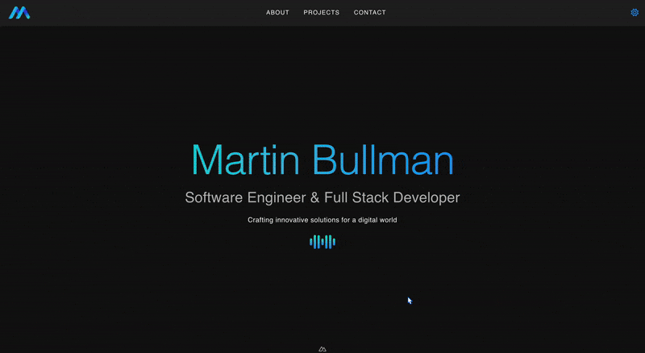

<div align="center">
    
</div>

<h1 align="center" style="margin-top: 15px">
    Martin Bullman Portfolio Application <br>
</h1>

<h3 align="center" style="margin-top: -20px;">
    <a href="https://martinbullman.xyz">https://martinbullman.xyz</a>
</h3><br>

<div align="center" style="margin-top: 20px">

[](https://github.com/mjbullman/martin-bulllman-app/actions/workflows/deploy-frontend.yml)
[](https://github.com/mjbullman/martin-bulllman-app/actions/workflows/deploy-backend.yml)
[](https://codecov.io/gh/mjbullman/martin-bulllman-app)
[](https://github.com/sponsors/mjbullman)


[](https://github.com/mjbullman/martin-bulllman-app/blob/readme-updates/LICENSE.md)

[](https://github.com/mjbullman/martin-bulllman-app/commits/main)


[](https://nodejs.org/)
[](https://vuejs.org/)
[](https://nuxt.com/)
[](https://vuetifyjs.com/)
[](https://www.djangoproject.com/)


[//]: # (![Tech Stack]&#40;https://img.shields.io/badge/Stack-Nuxt%203%20%2B%20Vuetify%203%20%2B%20Django%205-blueviolet?style=flat-square&#41;)
[//]: # (![Twitter]&#40;https://img.shields.io/twitter/follow/<username>?style=social&#41;)
[//]: # (![Stack]&#40;https://img.shields.io/badge/stack-React%20%2B%20Node.js%20%2B%20GraphQL-blue&#41;)
[//]: # (![PRs Welcome]&#40;https://img.shields.io/badge/PRs-welcome-brightgreen&#41;)

</div>

<div align="center">
    
</div>

<h3 align="center">
    A modern portfolio application built with <b>Vue 3</b>, <b>Nuxt 3</b>, <b>Vuetify 3</b>,
    and <b>Django</b> to showcase cutting-edge web development practices. 🚀
</h3>


## Key Features

- **Frontend:**
  - Developed using [Vue 3](https://vuejs.org/), [Nuxt 3](https://nuxt.com/), and [Vuetify 3](https://vuetifyjs.com/), offering a responsive and dynamic user interface.
  
- **Backend:**
  - Powered by [Django](https://www.djangoproject.com/), providing a robust backend with RESTful API endpoints for handling data and user interactions.

- **Deployment:**
  - The application is deployed using Docker and Docker Compose for simplified environment setup and scalability.

## Prerequisites

Before running the application, ensure you have the following installed:

- **Node.js** (v20.10.0 or later)
- **Python** (3.11.10 or later)
- **Docker** and **Docker Compose**

---

## Installation

### 1. Clone the Repository

```bash
git clone https://github.com/your-username/personal-web-app.git
cd personal-web-app
```

### 2. Frontend Setup

Navigate to the `frontend` directory:

```bash
cd frontend
```

Install NPM dependencies:

```bash
npm install
```

### 3. Backend Setup

Navigate to the `backend` directory:

```bash
cd backend
```

Create virtual environment and activate:
```bash
python3 -m venv venv
source venv/bin/activate
```

Install PIP dependencies:
```
pip install -r martinbullman/requirements.txt
```

Run database migrations for the Django backend:

```bash
python3 martinbullman/manage.py migrate
```

### 4. Database Migration

Run database migrations for the Django backend:

```bash
python manage.py migrate
```

### 5. Environment Variables

Create `.env` files in both `frontend` and `backend` directories with appropriate environment variables:

#### Frontend (`frontend/.env`):

```env
API_BASE_URL=http://127.0.0.1:8000/api
```

#### Backend (`backend/.env`):

```env
SECRET_KEY=your-secret-key
DEBUG=True
ALLOWED_HOSTS=127.0.0.1,localhost
```

---

## Testing

### Frontend

Run unit tests for the frontend using **Jest** (or your preferred testing library):

```bash
cd frontend
npm run test
```

For end-to-end tests using **Playwright** or **Cypress**:

```bash
npm run test:e2e
```

### Backend

Run tests for the Django backend using **pytest**:

```bash
cd backend
pytest
```

```bash
cd frontend
npm run test
```

Run Lint

```bash
cd frontend
npm run lint
```

To check test coverage:

```bash
pytest --cov=.
```

---

## Docker Setup

### 1. Build Docker Images

```bash
docker-compose build
```

### 2. Start the Containers

```bash
docker-compose up
```

The application will be available at:

- **Frontend**: `http://localhost:3000`
- **Backend API**: `http://localhost:8000/api`

### 3. Stop the Containers

To stop and remove containers, networks, and volumes:

```bash
docker-compose down
```

---

## Deployment

- **Frontend**: Use static hosting platforms like Vercel or Netlify for Nuxt 3 apps.
- **Backend**: Deploy the Django application using services like AWS, Heroku, or DigitalOcean with a WSGI/ASGI server (e.g., Gunicorn).
- **Docker**: Use Docker containers for deployment in cloud services or Kubernetes environments.

---

## Contributing

Feel free to fork this repository, raise issues, or submit pull requests.

---

## License

This project is licensed under the MIT License. See the [LICENSE](LICENSE) file for details.

---

## Acknowledgments


- [Vue.js](https://vuejs.org/)
- [Nuxt 3](https://nuxt.com/)
- [Vuetify](https://vuetifyjs.com/)
- [Django](https://www.djangoproject.com/)
- [Django REST Framework](https://www.django-rest-framework.org/)
- [Docker](https://www.docker.com/)
