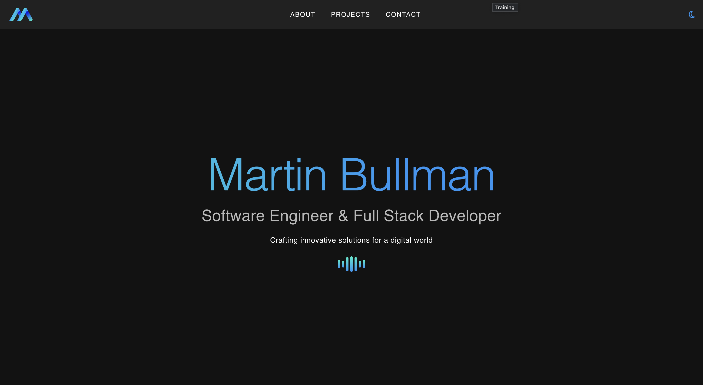

<div align="center">
  
</div>

<h1 align="center">
  martinbullman.xyz
</h1>

<hr>

[](https://github.com/mjbullman/martin-bulllman-app/actions/workflows/deploy-frontend.yml)
[](https://github.com/mjbullman/martin-bulllman-app/actions/workflows/deploy-backend.yml)





# Personal Web Application

This is a personal web application built using modern technologies for a seamless and efficient user experience. The application uses **Vue 3**, **Nuxt 3**, and **Vuetify 3** for the frontend and a **Django backend** with a REST API for managing data and business logic.


## Prerequisites

Before running the application, ensure you have the following installed:

- **Node.js** (v16 or later)
- **Python** (v3.9 or later)
- **Docker** and **Docker Compose**
- **Nuxt CLI** (for Nuxt 3 projects)

---

## Installation

### 1. Clone the Repository

```bash
git clone https://github.com/your-username/personal-web-app.git
cd personal-web-app
```

### 2. Frontend Setup

Navigate to the `frontend` directory and install dependencies:

```bash
cd frontend
npm install
```

### 3. Backend Setup

Navigate to the `backend` directory and set up a Python virtual environment:

```bash
cd backend
python -m venv venv
source venv/bin/activate  # On Windows: venv\Scripts\activate
pip install -r requirements.txt
```

### 4. Database Migration

Run database migrations for the Django backend:

```bash
python manage.py migrate
```

### 5. Environment Variables

Create `.env` files in both `frontend` and `backend` directories with appropriate environment variables:

#### Frontend (`frontend/.env`):

```env
API_BASE_URL=http://127.0.0.1:8000/api
```

#### Backend (`backend/.env`):

```env
SECRET_KEY=your-secret-key
DEBUG=True
ALLOWED_HOSTS=127.0.0.1,localhost
```

---

## Testing

### Frontend

Run unit tests for the frontend using **Jest** (or your preferred testing library):

```bash
cd frontend
npm run test
```

For end-to-end tests using **Playwright** or **Cypress**:

```bash
npm run test:e2e
```

### Backend

Run tests for the Django backend using **pytest**:

```bash
cd backend
pytest
```

To check test coverage:

```bash
pytest --cov=.
```

---

## Docker Setup

### 1. Build Docker Images

```bash
docker-compose build
```

### 2. Start the Containers

```bash
docker-compose up
```

The application will be available at:

- **Frontend**: `http://localhost:3000`
- **Backend API**: `http://localhost:8000/api`

### 3. Stop the Containers

To stop and remove containers, networks, and volumes:

```bash
docker-compose down
```

---

## Deployment

- **Frontend**: Use static hosting platforms like Vercel or Netlify for Nuxt 3 apps.
- **Backend**: Deploy the Django application using services like AWS, Heroku, or DigitalOcean with a WSGI/ASGI server (e.g., Gunicorn).
- **Docker**: Use Docker containers for deployment in cloud services or Kubernetes environments.

---

## Contributing

Feel free to fork this repository, raise issues, or submit pull requests.

---

## License

This project is licensed under the MIT License. See the [LICENSE](LICENSE) file for details.

---

## Acknowledgments


- [Vue.js](https://vuejs.org/)
- [Nuxt 3](https://nuxt.com/)
- [Vuetify](https://vuetifyjs.com/)
- [Django](https://www.djangoproject.com/)
- [Django REST Framework](https://www.django-rest-framework.org/)
- [Docker](https://www.docker.com/)
